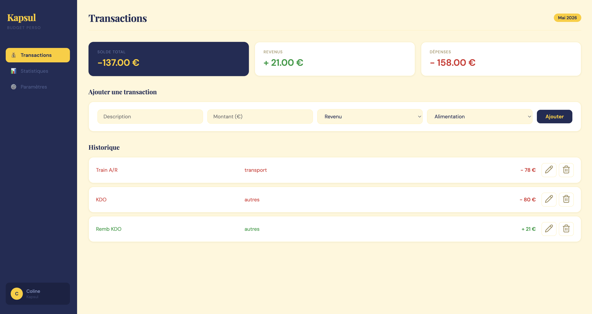
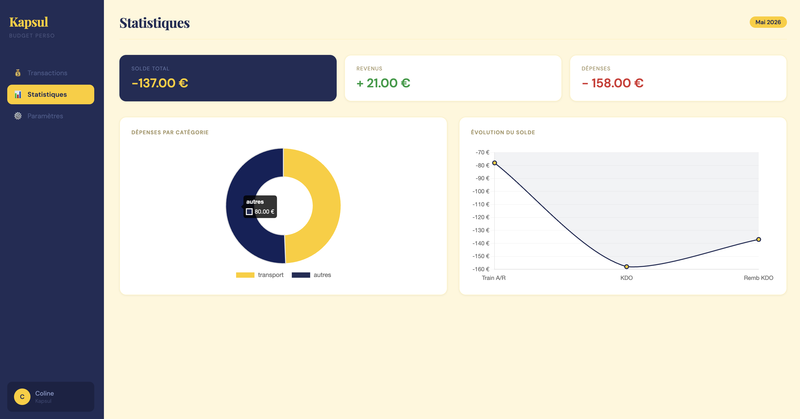
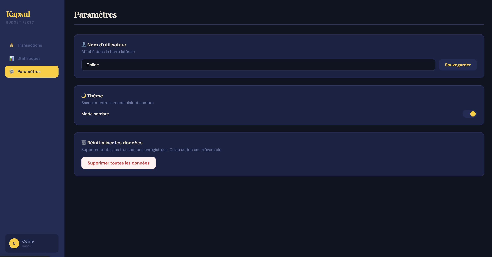

# Kapsul 💰

**FR** — Application de gestion de budget personnel  
**EN** — Personal budget management app

---

## 🇫🇷 Français

### Description

Kapsul est une application web de gestion de budget personnel. L'idée : capturer toutes ses finances dans une capsule — rien ne s'échappe.

Projet réalisé en HTML, CSS et JavaScript vanilla, sans framework ni base de données. Toutes les données sont stockées localement dans le navigateur via `localStorage`.

### Fonctionnalités

**💸 Transactions**
- Ajout de revenus et de dépenses avec description, montant et catégorie
- Modification et suppression de chaque transaction
- Calcul automatique du solde total, des revenus et des dépenses
- Persistance des données via `localStorage` — les données sont conservées entre les sessions

**📊 Statistiques**
- Visualisation des dépenses par catégorie sous forme de donut (Chart.js)
- Courbe d'évolution du solde au fil des transactions

**⚙️ Paramètres**
- Basculer entre le mode clair et le mode sombre
- Personnalisation du nom d'utilisateur affiché dans la sidebar
- Réinitialisation complète des données

**📱 Général**
- Interface responsive : sidebar sur desktop, sidebar réduite sur tablette, tab bar en bas sur mobile
- Homepage d'accueil avec présentation du concept

---

## 🇬🇧 English

### Description

Kapsul is a personal budget management web app. The idea: capture all your finances in one capsule — nothing escapes.

Built with HTML, CSS and vanilla JavaScript — no framework, no database. All data is stored locally in the browser via `localStorage`.

### Features

**💸 Transactions**
- Add income and expenses with description, amount and category
- Edit or delete any transaction
- Automatic calculation of total balance, income and expenses
- Data persisted via `localStorage` — saved between sessions

**📊 Statistics**
- Expenses breakdown by category as a donut chart (Chart.js)
- Balance evolution curve across transactions

**⚙️ Settings**
- Toggle between light and dark mode
- Customisable username displayed in the sidebar
- Full data reset option

**📱 General**
- Responsive UI: sidebar on desktop, icon-only sidebar on tablet, bottom tab bar on mobile
- Homepage introducing the concept

---

## 🛠 Stack

`HTML` · `CSS` · `JavaScript` · `Chart.js` · `Lucide Icons`
